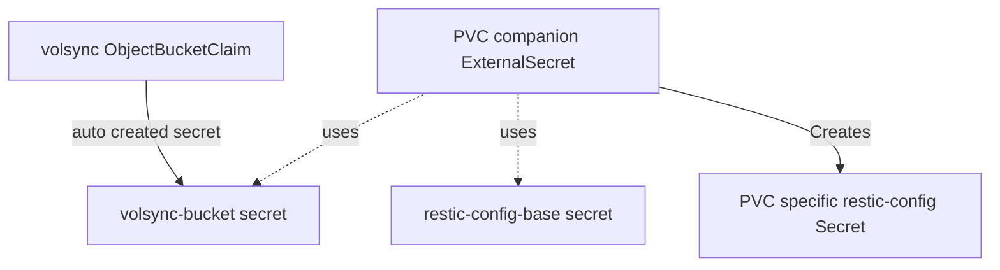

```mermaid
graph TD
volsync-bucket[volsync ObjectBucketClaim]
-->|auto created secret| sb-secret[volsync-bucket secret]

restic-config-base-secret[restic-config-base secret]

externalSecret -.-> |uses| restic-config-base-secret & sb-secret

externalSecret[PVC companion ExternalSecret]

externalSecret --> |Creates| volsync-restic-repo-rgw-secret[PVC specific restic-config Secret]
```

`PVC companion ExternalSecret` should suffix `RESTIC_REPOSITORY` value from `restic-config-base` to avoid using same path for few distinct repositories.